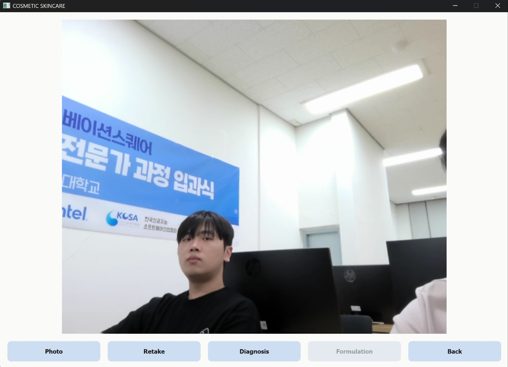
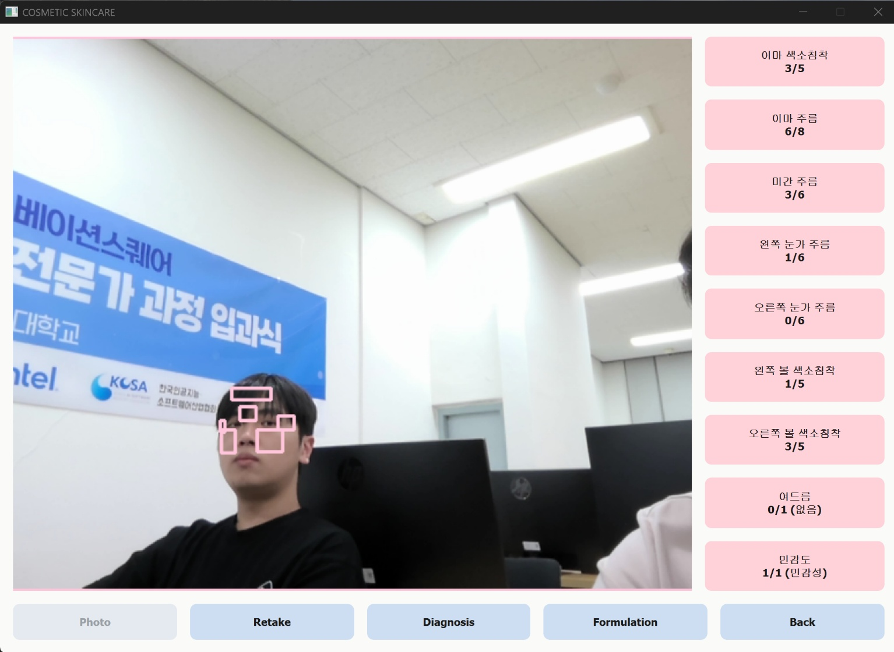
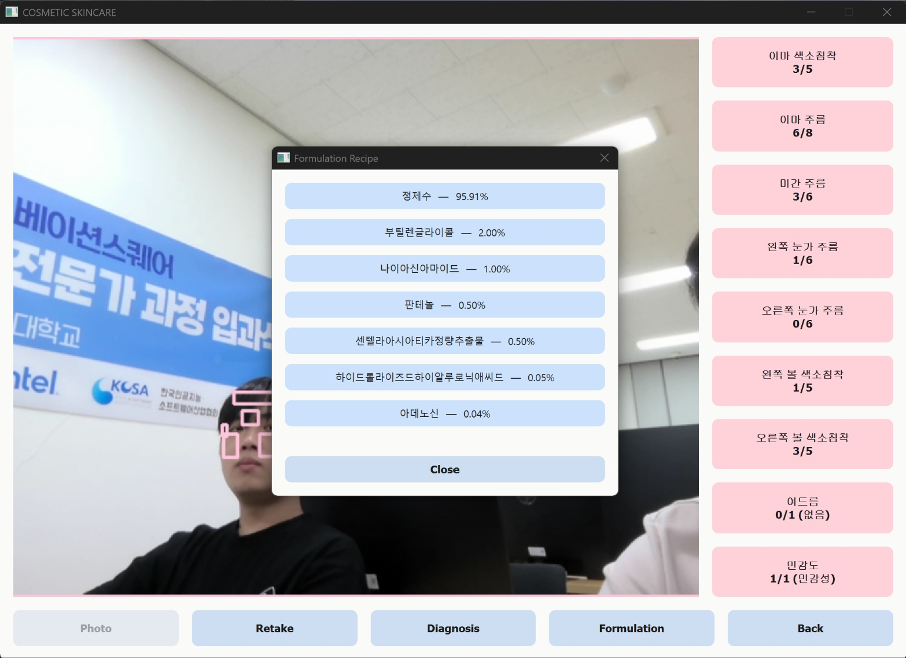

# Skin Detection Web Prototype (2025)

이 레포지토리는 제가 제작한 피부 분석 사이트의 프로토타입 결과물을 정리한 포트폴리오용 저장소입니다.

## 📌 프로젝트 개요
- 피부 톤/트러블 분류 테스트용 사이트 화면 제작
- 초기 UI 프로토타입 구성
- AI 기반 기능 일부 테스트
- 향후 AWS 서버와 연동해 실시간 분석 기능 추가 예정

## 📸 Screenshots
아래는 현재까지 구현된 완성본 화면입니다.

### 2) 피부 분석 결과 화면

### 3) 스킨 포뮬라 추천 화면

## 🧩 진행한 작업
- 웹 UI 구성, 버튼 레이아웃 설계
- 스킨 테스트 페이지 제작
- 사용자 화면 흐름 설계
- 이미지 기반 기본 분석 기능 구현

## 🚀 향후 업데이트 계획
- AWS Lambda + API Gateway 기반 서버 로직 개발
- 사용자 수 실시간 추적 기능 추가
- 모델 정확도 개선 및 추가 분석 메뉴 개발
